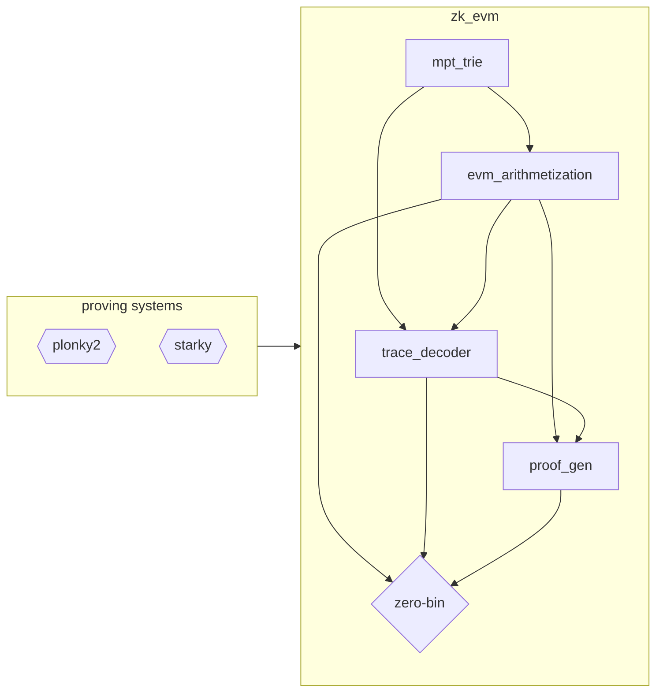

# zk_evm

A collection of libraries to prove Ethereum blocks with Polygon Zero Type 1 zkEVM,
powered by [starky and plonky2](https://github.com/0xPolygonZero/plonky2) proving systems.

## Directory structure

This repository contains the following Rust crates:

* [mpt_trie](./mpt_trie/README.md): A collection of types and functions to work with Ethereum Merkle Patricie Tries.

* [smt_trie](./smt_trie/README.md): A collection of types and functions to work with Polygon Hermez Sparse Merkle Trees (SMT).

* [trace_decoder](./trace_decoder/Cargo.toml): Flexible protocol designed to process Ethereum clients trace payloads into an IR format that can be
understood by the zkEVM prover.

* [evm_arithmetization](./evm_arithmetization/README.md): Defines all the STARK constraints and recursive circuits to generate succinct proofs of EVM execution.
It uses starky and plonky2 as proving backend: https://github.com/0xPolygonZero/plonky2.

* [proof_gen](./proof_gen/README.md): A convenience library for generating proofs from inputs already in Intermediate Representation (IR) format.

* [zero_bin](./zero_bin/README.md): A composition of [`paladin`](https://github.com/0xPolygonZero/paladin) and [`proof_gen`](./proof_gen/README.md) to generate
EVM block proofs.

## Dependency graph

Below is a simplified view of the dependency graph, including the proving system backends and the application layer defined within [zero-bin](https://github.com/0xPolygonZero/zero-bin).

<!---
TODO: Update mermaid chard with `smt_trie` once type-2 is plugged in.
-->

## Documentation

Documentation is still incomplete and will be improved over time, a lot of useful material can
be found in the [docs](./docs/) section, including:

* [sequence diagrams](./docs/usage_seq_diagrams.md) for the proof generation flow
* [zkEVM specifications](./docs/arithmetization/zkevm.pdf), detailing the underlying EVM proving statement

## Branches
The default branch for the repo is the `develop` branch which is not stable but under active development. Most PRs should target `develop`. If you need a stable branch then a tagged version of `main` is what you're after.
It should be assumed that `develop` will break and should only be used for development. 

## Building

The zkEVM stack currently requires the `nightly` toolchain, although we may transition to `stable` in the future.
Note that the prover uses the [Jemalloc](http://jemalloc.net/) memory allocator due to its superior performance.

## License

Licensed under either of

* Apache License, Version 2.0, ([LICENSE-APACHE](LICENSE-APACHE) or http://www.apache.org/licenses/LICENSE-2.0)
* MIT license ([LICENSE-MIT](LICENSE-MIT) or http://opensource.org/licenses/MIT)

at your option.

### Contribution

Unless you explicitly state otherwise, any contribution intentionally submitted for inclusion in the work by you,
as defined in the Apache-2.0 license, shall be dual licensed as above, without any additional terms or conditions.
