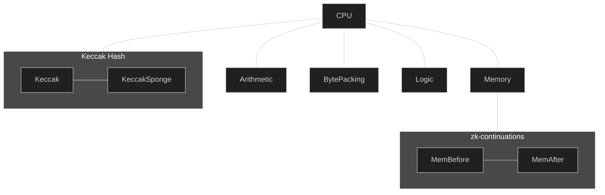

# Tables

Our EVM statements are decomposed into several STARK tables, each corresponding to some coprocessor capable of handling specific operations,
orchestrated by a [Central Processing Unit](./cpu.md).

Each coprocessor execution can be proven independently and concurrently, and a global check (via our [cross-table lookups](../framework/ctls.md))
enforces consistency of values being shared across multiple coprocessors.

Below is a depiction of the current decomposition of EVM statements execution[^1]:

[^1]: This diagram is simplified, and does not represent *all* interactions between co-processors.