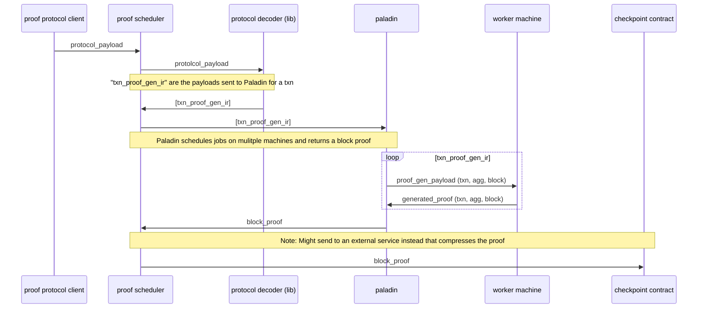
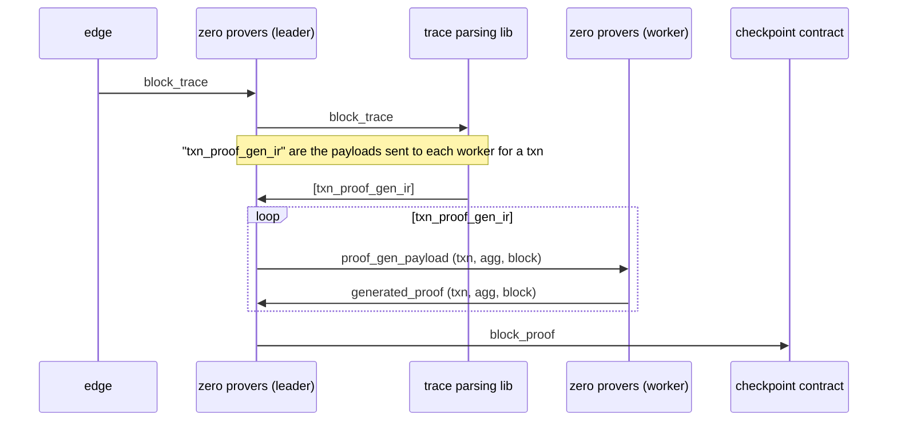

# Usage Diagrams
These are some hacked together diagrams showing how the protocol will (likely) be used. Also included what the old Edge proof generation process looked like as a reference.

## Proof Protocol

## Edge Proof Generation

