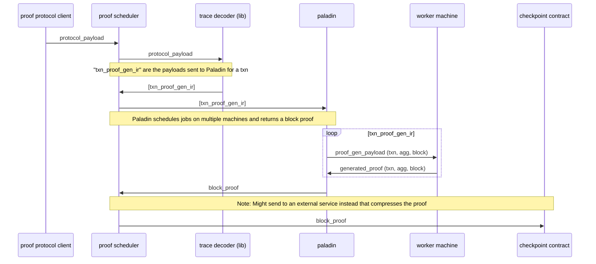

# Usage Diagrams

These are some diagrams showing how the protocol is implemented.

## Proof Generation

```mermaid
sequenceDiagram
    proof protocol client->>proof scheduler: protocol_payload
    proof scheduler->>trace decoder (lib): protocol_payload
    Note over proof scheduler,trace decoder (lib): "txn_proof_gen_ir" are the payloads sent to Paladin for a txn
    trace decoder (lib)->>proof scheduler: [txn_proof_gen_ir]
    proof scheduler->>paladin: [txn_proof_gen_ir]
    Note over proof scheduler,paladin: Paladin schedules jobs on multiple machines and returns a block proof
    loop txn_proof_gen_ir
        paladin->>worker machine: proof_gen_payload (txn, agg, block)
        worker machine->>paladin: generated_proof (txn, agg, block)
    end
    paladin->>proof scheduler: block_proof
    Note over proof scheduler,checkpoint contract: Note: Might send to an external service instead that compresses the proof
    proof scheduler->>checkpoint contract: block_proof
```
